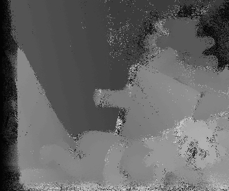

# coof-stereo

In this repository, co-occurrence filter is applied in stereo matching.

More description about the co-occurrence filter can be found in the article：
Jevnisek, Roy Josef, and Shai Avidan. "[Co-occurrence Filter](https://arxiv.org/pdf/1703.04111.pdf)" CVPR. 2017.

* * *

The steps of stereo matching are as follows：
1)matching cost calculation 
2)cost aggregation with coof 
3)disparity calculation

## Experimental result: disparity map

